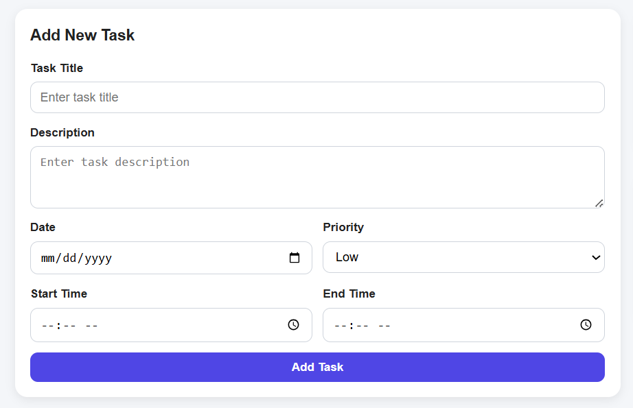
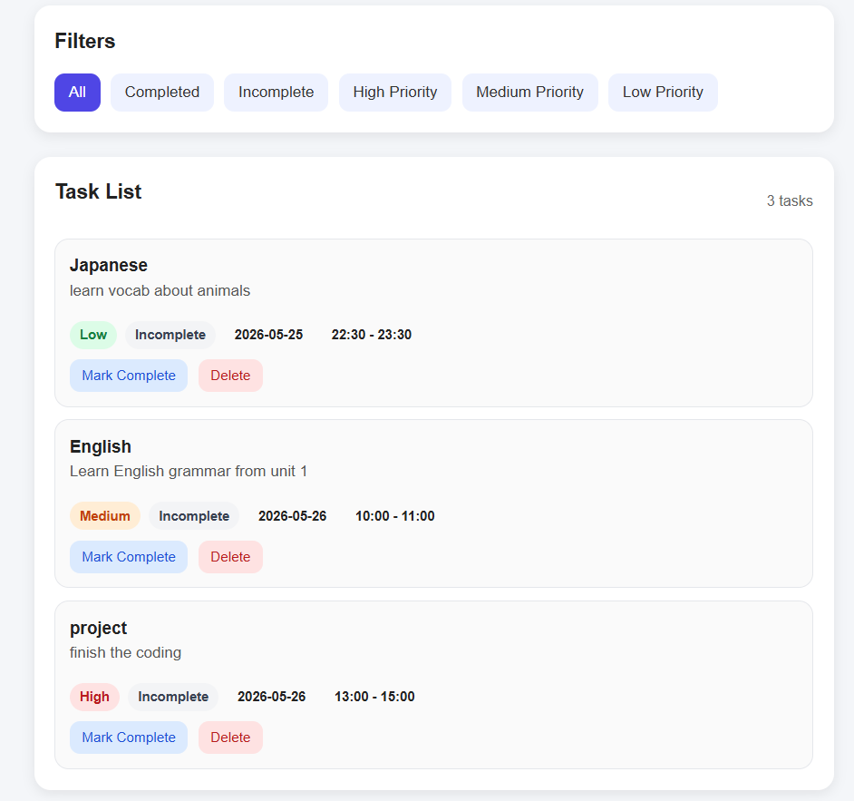
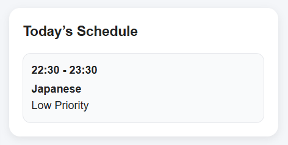
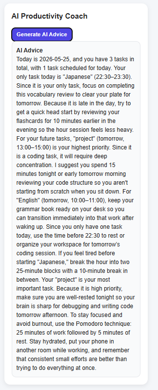

# Smart To-Do App(English Version)

AI-powered productivity and task management web application for university students.
This system helps students organize tasks, manage schedules, and receive AI-generated productivity advice based on their daily workload.

Live Demo:  
https://heroic-yeot-bcf2c4.netlify.app/

---

## Features

- Add, update, and delete tasks
- Task priority management(High / Medium / Low)
- Task filtering system
- Time blocking with start and end times
- Today's schedule dashboard
- AI productivity coach using Gemini API
- Responsive UI design

---

## Tech Stack

### Frontend
- HTML
- CSS
- JavaScript

### Backend
- Python
- Flask
- Flask-CORS

### Database
- Firebase Firestore

### AI Integration
- Gemini API

### Deployment
- Netlify
- Render

---

## System Architecture

```text
Frontend (HTML/CSS/JavaScript)
        ↓
Flask Backend REST API
        ↓
Firebase Firestore
        ↓
Gemini AI API
```

---

## Project Structure

```text
frontend/
│
├── index.html
├── style.css
├── app.js

backend/
│
├── app.py
├── requirements.txt
```

---

## Main Features

### Task Management
Users can:
- Add tasks
- Set task priority
- Assign date and time
- Mark tasks as complete/incomplete
- Delete tasks

The frontend communicates with the Flask backend using REST APIs.

### Smart Filtering
Users can filter tasks by:
- Completed
- Incomplete
- High Priority
- Medium Priority
- Low Priority

The filtering logic is implemented dynamically using JavaScript

### Today’s Schedule Dashboard
The app :
- Detects today's tasks
- Sorts tasks by date and time
- Displays the current daily schedule

This improves time management and task visibility for students.

### AI Productivity Coach
The app uses Gemini AI to:
- Analyzes today’s and future tasks
- Identifies high-priority work
- Suggests scheduling strategies
- Recommend study planning
- Detect heavy workload
- Help avoid burnout


The backend sends task data to Gemini API using Flask

---

## REST API

| Method | Endpoint | Description |
|---|---|---|
| GET | /tasks | Get all tasks |
| POST | /tasks | Create new task |
| PUT | /tasks/<id> | Update task |
| DELETE | /tasks/<id> | Delete task |
| POST | /ai-suggestions | Generate AI advice |

Backend implementation is written using Flask REST API architecture.

---
## Security
Sensitive information is protected using environment variables:
-Gemini API Key
-Firebase Service Account Credentials

## Installation

### Clone Repository

```bash
git clone YOUR_GITHUB_REPOSITORY
```

### Install Backend Packages

```bash
pip install -r requirements.txt
```

### Run Flask Backend

```bash
python app.py
```

### Start Frontend

Open index.html using Live Server.

---

## Environment Variables

Create a `.env` file or set environment variables:

```env
GEMINI_API_KEY=your_api_key
FIREBASE_SERVICE_ACCOUNT_JSON=your_firebase_json
```

---

## Screenshots
### Add task form


### Task Lists


### Today's Schedule


### AI Productivity Coach


---

## What I Learned

Through this project, I learned:
- Full-stack web development
- REST API development
- Firebase Firestore integration
- AI API integration
- Frontend/backend communication
- Responsive UI design
- Production debugging

---


## Author

Hein Zayar Oo　| 日本工学院八王子専門学校(ITカレッジ　情報処理科) | 東京工科大学(コンピューターサイエンス学部　コンピューターサイエンス学科)

